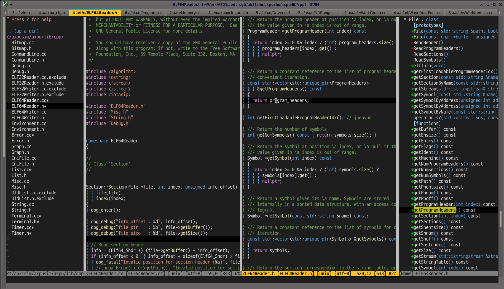

# Sidebar

 - A simple vim script to use 'Tagbar' and 'NERDTree'
 - Open 'NERDTree' on left-most-window and open 'Tagbar' on right-most-window
 - **When focus is changed to another window or open other file, 'NERDTree' will be automatically update**

 - Refer 'https://github.com/preservim/nerdtree' for more details about 'NERDTree'
 - Refer 'https://github.com/preservim/tagbar' for more details about 'Tagbar'

 - Screenshot

	

## Installation

- Install 'vim-plug' 
	- refer 'https://github.com/junegunn/vim-plug' for more details about 'vim-plug'

	- Linux
	```
	curl -fLo ~/.vim/autoload/plug.vim --create-dirs \
	https://raw.githubusercontent.com/junegunn/vim-plug/master/plug.vim
	```

	- Windows ( Powershell )
	```csh
	iwr -useb https://raw.githubusercontent.com/junegunn/vim-plug/master/plug.vim |`
	   ni $HOME/vimfiles/autoload/plug.vim -Force
	```
- Install **Sidebar**, NERDTree, Tagbar

	- Add following lines in your .vimrc

	```
	call plug#begin('~/.vim/plugged')
	Plug 'preservim/tagbar'
	Plug 'preservim/nerdtree'
	Plug 'juehyun/sidebar'
	call plug#end()
	```

 - Open gvim (or vim) and type following command
	```
	:PlugInstall
	```

 - From time to time ... update changes :)
	```
	:PlugUpdate
	```

## Usages
- in gvim (or vim) type the following
	```
	<Leader>sb
	```
- By default, \<Leader\> key is '\\', therefore, type the following, that's all
	```
	\sb
	```
